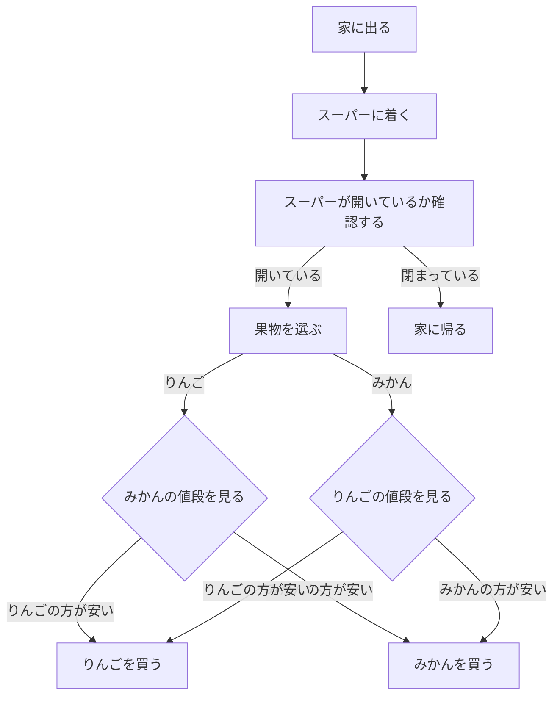

# ヘッダー

これはテストページです

```mermaid
flowchart TD;
A[家に出る] --> B[スーパーに着く];
B --> C[スーパーが開いているか確認する];
C -- 開いている --> D[果物を選ぶ];
C -- 閉まっている --> E[家に帰る];
D -- りんご --> F{みかんの値段を見る};
D -- みかん --> G{りんごの値段を見る};
F -- りんごの方が安い --> H[りんごを買う];
F -- みかんの方が安い --> I[みかんを買う];
G -- みかんの方が安い --> I;
G -- りんごの方が安い --> H;
```

## サブヘッダー

